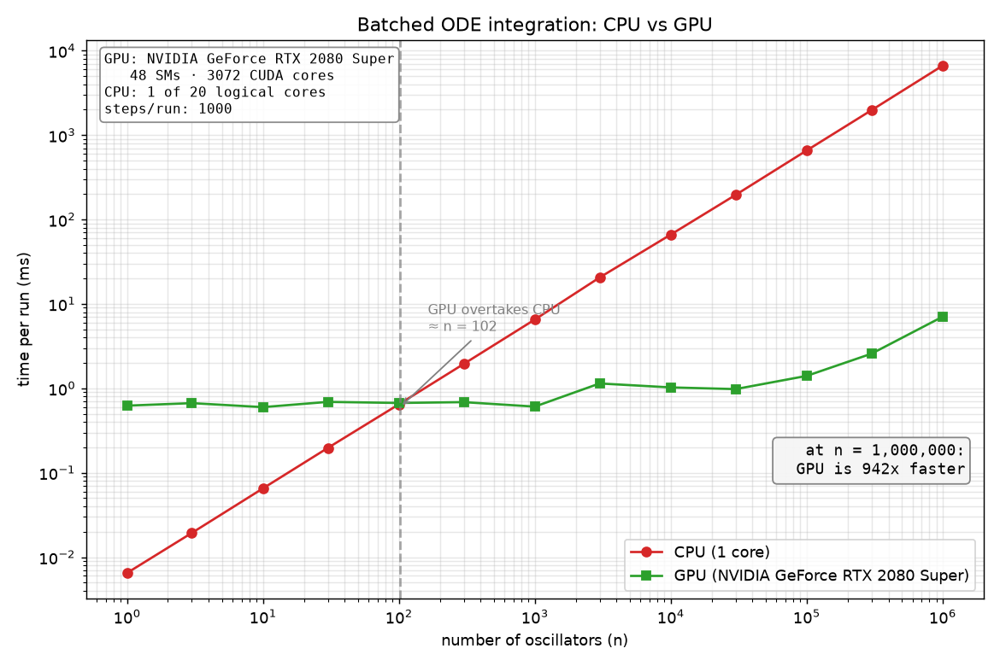
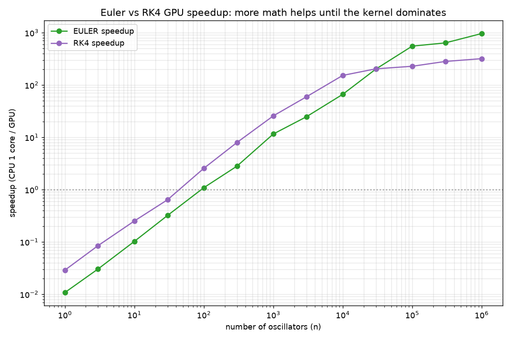

# Parallel ODE Integrator

Integrate a large batch of independent ODEs (damped harmonic oscillators)
forward in time with a fixed-step method, once on a single CPU core and once on
the GPU, and compare wall-clock time as the batch size grows.

Each oscillator obeys `x'' + 2·ζ·ω·x' + ω²·x = 0`, integrated with semi-implicit
(symplectic) Euler. Every oscillator in the batch is independent, which makes
this an ideal first "embarrassingly parallel" CUDA problem: one GPU thread per
oscillator.

## Results

Measured on an NVIDIA GeForce RTX 2080 Super (48 SMs, 3072 CUDA cores) vs a
single CPU core, 1000 integration steps per run. Every GPU result is verified
bit-for-bit against the CPU reference.



| n | CPU 1-core (ms) | GPU total (ms) | GPU kernel (ms) | Speedup |
|--:|--:|--:|--:|--:|
| 1,000 | 6.48 | 0.56 | 0.03 | 11.5× |
| 10,000 | 65.3 | 0.99 | 0.06 | 66× |
| 100,000 | 654.0 | 1.18 | 0.16 | 552× |
| 1,000,000 | 6547 | 6.81 | 1.30 | **961×** |

The GPU line is nearly flat until the hardware saturates (thousands of cores sit
idle at small n), while the single-core CPU rises linearly. They cross at about
**n = 87** — below that the GPU's transfer + launch overhead isn't worth it. At
n=1M the **kernel is only 1.3 ms of the 6.8 ms total** — the rest is PCIe data
transfer, so this workload is memory-bound, not compute-bound.

### Euler vs RK4: more math per byte helps — up to a point



RK4 does 4 derivative evaluations per step vs Euler's 1. That extra arithmetic
gives more compute to hide behind the same transfer, so RK4's speedup is **higher
at small-to-mid n** (e.g. n=10k: **152× RK4 vs 66× Euler**). But past ~30k the
heavier RK4 kernel itself becomes the bottleneck, and its speedup falls back
below Euler — a nice illustration that "more compute" only helps while the
kernel is still cheap relative to the data transfer.

📄 **See [REPORT.md](REPORT.md)** for the full write-up: time-complexity analysis,
kernel-vs-transfer timing, the Euler-vs-RK4 comparison, and why the curves
behave as they do. **See [LESSONS.md](LESSONS.md)** for a concept-by-concept FAQ
(why 256 threads, pointer vs reference, the toolchain gotchas, git, …).

## Files

- `include/ode_solver.h` — shared structs and function declarations.
- `src/ode_solver_cpu.cpp` — single-core CPU reference.
- `src/ode_solver_gpu.cu` — CUDA kernel (one thread per oscillator) + host wrapper.
- `src/benchmark.cpp` — generates data, times both, checks correctness, writes
  `results.csv`, then auto-plots.
- `plot_results.py` — renders `results.csv` into `benchmark.png` and opens it.
- `build.bat` / `run.bat` — Windows build and run+plot helpers.

## Build & run (Windows)

Needs the CUDA Toolkit, Visual Studio (C++), and Python + matplotlib for the plot.

```
cuda-hpc\01_parallel_ode_integrator\build.bat     # compile (loads x64 toolchain)
cuda-hpc\01_parallel_ode_integrator\run.bat       # run + auto-plot + open graph
```

`build.bat` loads the 64-bit MSVC environment automatically, so it works from
any terminal. `run.bat` runs the benchmark, which writes `results.csv`, renders
`benchmark.png`, and opens it.

## Build with CMake (Linux, or Windows with a configured generator)

```
cmake -B build -S cuda-hpc
cmake --build build --parallel
```
